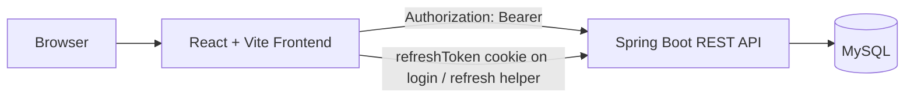

# Student Task Manager

Student Task Manager is a full-stack student task tracking application with a React frontend, a Spring Boot REST API, and a MySQL database.

## What is implemented

- User registration and login
- Password hashing with BCrypt
- JWT access tokens returned from login
- Refresh-token entity and HttpOnly refresh cookie creation on login
- Task create, read, update, and delete operations
- Task filtering by status
- Client-side search and priority filtering in the frontend
- Dashboard summary cards and analytics charts
- Optional task subject/category field
- Responsive frontend layout with a landing page, sidebar, dashboard, and task workspace

## Repository layout

- `Studenttaskmanager-frontend/` - React + Vite frontend
- `StudentTaskManager-backend/` - Spring Boot backend
- `docs/architecture/` - system design documentation
- `docs/api/` - API and schema documentation
- `docs/core/` - workflow, readiness, and security notes
- `docs/setup/` - deployment and setup guides
- `docs/presentation/` - demo and viva notes
- `docs/reports/` - verification and release snapshots
- `docs/archive/` - archived duplicates and boilerplate docs
- `docs/archived/` - older archived backups preserved from earlier cleanup
- `exports/` - generated schema and endpoint reference CSV files

## Architecture at a glance



The backend is structured as controller, service, repository, model, DTO, security, and exception layers. The frontend is structured as pages, reusable components, API wrappers, and authentication context.

## Key implementation notes

- The backend listens on `PORT` if that environment variable is present; otherwise it defaults to `8080`.
- The frontend API base URL defaults to `http://localhost:8080/api` when `VITE_API_BASE_URL` is not set.
- Backend CORS origins are currently hardcoded in `SecurityConfig.java` for `https://student-task-management-system.netlify.app` and local ports `5173`, `5174`, and `5175`.
- The security configuration currently permits only `/api/users/register`, `/api/users/login`, and `/actuator/**` without authentication.
- The login controller creates an HttpOnly `refreshToken` cookie, but the current security rules do not explicitly exempt `/api/users/refresh` or `/api/users/logout`. That should be reviewed before production use.
- The task model stores `subject` as an optional field. Analytics group tasks by `subject`, falling back to `Uncategorized` when the field is blank.
- Task updates are ownership-checked. A user can only update or delete their own tasks.
- Completed tasks cannot be changed back to pending in the current service logic.

## Local setup

### Backend

```bash
cd StudentTaskManager-backend
./mvnw spring-boot:run
```

On Windows:

```powershell
cd StudentTaskManager-backend
.\mvnw.cmd spring-boot:run
```

### Frontend

```bash
cd Studenttaskmanager-frontend
pnpm install
pnpm dev
```

You can also use `npm install` and `npm run dev` if you prefer npm.

## Environment variables

### Backend

- `SPRING_DATASOURCE_URL` - JDBC URL for MySQL
- `SPRING_DATASOURCE_USERNAME` - database username
- `SPRING_DATASOURCE_PASSWORD` - database password
- `JWT_SECRET` - JWT signing secret
- `JWT_EXPIRATION_MS` - access-token lifetime in milliseconds
- `JWT_REFRESH_EXPIRATION_MS` - refresh-token lifetime in milliseconds
- `PORT` - runtime port override used by the application server

Default backend values are defined in `StudentTaskManager-backend/src/main/resources/application.properties`.

### Frontend

- `VITE_API_BASE_URL` - base URL for the backend API, for example `http://localhost:8080/api`

## Main API surface

- `POST /api/users/register`
- `POST /api/users/login`
- `POST /api/users/refresh`
- `POST /api/users/logout`
- `POST /api/tasks/create`
- `GET /api/tasks`
- `GET /api/tasks/summary`
- `PUT /api/tasks/update/{taskId}`
- `DELETE /api/tasks/delete/{taskId}`
- `GET /api/analytics/summary`

## Documentation map

- `docs/architecture/ARCHITECTURE.md` - system and module architecture
- `docs/api/TECHNICAL_DETAILS.md` - schema, DTOs, endpoints, and request/response details
- `docs/core/WORKFLOW.md` - user journeys and screen-by-screen behavior
- `docs/setup/DEPLOYMENT.md` - local and production deployment instructions
- `docs/core/SECURITY_VERIFICATION.md` - security posture and known gaps
- `docs/core/FINAL_READINESS_REPORT.md` - submission-oriented status summary
- `docs/setup/DEPLOY_CHECKLIST.md` - deployment checklist
- `docs/presentation/DEMO_GUIDE.md` - demo script
- `docs/presentation/DEPLOY_VIVA_CARD.md` - viva quick reference
- `docs/reports/TEST_REPORT.md` - verification notes
- `docs/reports/RELEASE_NOTES.md` - release snapshot
