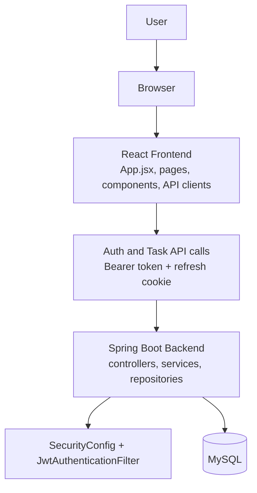

# Architecture Overview

## System Overview

The project is a two-tier web application:

- The frontend is a React application built with Vite.
- The backend is a Spring Boot REST API.
- Persistence is handled by MySQL through Spring Data JPA.

The frontend is responsible for routing, forms, filtering, charts, and session persistence in `localStorage`. The backend is responsible for authentication, authorization checks, task persistence, analytics aggregation, and validation.

## High-level architecture

## Frontend architecture

### Routing

- `App.jsx` defines the browser routes.
- `/` shows the landing page when the user is not authenticated.
- `/login` and `/register` handle authentication.
- `/dashboard` and `/tasks` are wrapped by `AppLayout`.

### State management

- `AuthContext.jsx` stores the authenticated user and JWT token in React state and `localStorage`.
- `Dashboard.jsx` loads task summary data and analytics data.
- `MyTasks.jsx` stores the task list, form state, filters, search text, and edit state.

### Frontend API layer

- `src/api/auth.js` handles register, login, refresh, and logout requests.
- `src/api/tasks.js` handles task list, summary, create, update, and delete requests.
- `src/api/analytics.js` handles analytics summary requests.

The API wrappers attach the `Authorization: Bearer <token>` header when a token is present. On `401` responses, the task and analytics clients try the refresh endpoint once and then retry the original request.

### UI components

- `AppLayout.jsx` provides the authenticated shell and sidebar.
- `Sidebar.jsx` exposes navigation and logout.
- `TaskForm.jsx` renders create/edit inputs.
- `TaskFilters.jsx` renders status, priority, and search controls.
- `TaskCard.jsx` renders a single task with due-date badges and action buttons.
- `TaskStats.jsx` shows the task counters.
- `UpcomingDeadlines.jsx` highlights the next tasks due soon.
- `AnalyticsCharts.jsx` renders Chart.js visualizations.

## Backend architecture

### Controller layer

- `UserController` exposes register, login, refresh, and logout routes.
- `TaskController` exposes task CRUD and summary routes.
- `AnalyticsController` exposes the analytics summary route.

### Service layer

- `UserService` handles registration, credential checks, and JWT creation.
- `TaskService` handles task ownership, create/update/delete logic, and summary calculations.
- `AnalyticsService` aggregates analytics from task data.
- `RefreshTokenService` creates and removes server-side refresh tokens.

### Repository layer

- `UserRepository` finds users by email.
- `TaskRepository` stores task queries and aggregate counts.
- `RefreshTokenRepository` stores and removes refresh tokens.

### Security and validation

- `PasswordEncoderConfig` provides BCrypt hashing.
- `JwtUtils` creates and validates HS256 JWTs.
- `JwtAuthenticationFilter` reads the Bearer token from the `Authorization` header and sets the Spring Security authentication principal to the token subject.
- `SecurityConfig` enforces stateless sessions and CORS, then requires authentication for all routes except register, login, and actuator endpoints.
- `GlobalExceptionHandler` converts validation and business exceptions into structured `ApiResponse` payloads.

## Data flow

### Registration and login

1. The user submits the registration or login form.
2. The frontend sends the request to `/api/users/register` or `/api/users/login`.
3. The backend validates the DTO, checks credentials, and stores the user or returns a JWT.
4. Login also creates a refresh token record and sets an HttpOnly cookie named `refreshToken`.
5. The frontend stores the returned `{ token, user }` pair in `localStorage`.

### Task lifecycle

1. The authenticated frontend loads `/api/tasks` and `/api/tasks/summary`.
2. Task creation and updates are sent to the backend with the JWT in the `Authorization` header.
3. The backend resolves the authenticated user from the JWT subject and enforces task ownership.
4. The frontend reloads task data and summary data after each mutation.

### Analytics lifecycle

1. The dashboard requests `/api/analytics/summary`.
2. The backend counts tasks by status, priority, due date, and subject.
3. The frontend renders completion, priority, category, and deadline charts with Chart.js.

## Important implementation constraints

- Search and priority filtering are client-side only. The backend task list endpoint filters only by `status`.
- `subject` is optional and is treated as a category label for analytics.
- The service layer prevents reverting a completed task back to pending.
- The login controller creates refresh tokens, but the current security rule set does not explicitly whitelist the refresh and logout endpoints.

